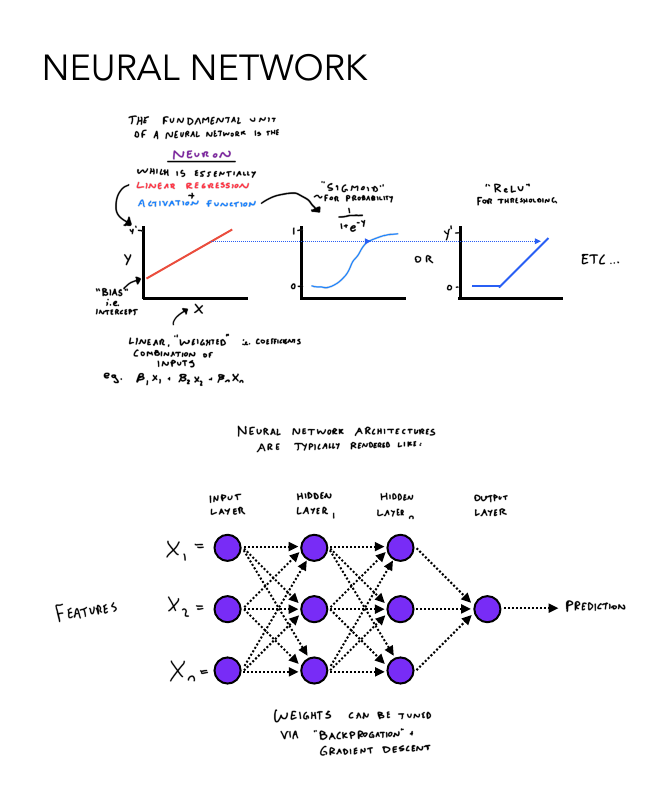

---
title: "Tabular Machine Learning Algorithms"
Author: Peter Dobranowski
date: "`r Sys.Date()`"

output: 
  bookdown::gitbook:
    split_by: section
  bookdown::pdf_book:
    keep_tex: no
documentclass: book
---


```{r setup, include=FALSE} 
knitr::opts_chunk$set(warning = FALSE, message = FALSE, echo = FALSE) 
```

```{r}
# To convert pdf to png, use this:
#plot.rreg = pdftools::pdf_convert("./ml_figures/Regularized_regression.pdf", format = "png", pages = 1, filenames = #"./ml_figures/Regularized_regression.png")
#knitr::include_graphics("./ml_figures/Regularized_regression.png")
```

```{r, out.width = "800px"}
# A visual description of the "decision tree"
knitr::include_graphics("./ml_figures/Decision_tree.png")
```

Recursively splits observations (classes or values) based on binary rules. The best rule (split) based on a splitting criterion is placed at the root of the tree, followed by recursive rules down the branches. The tree stops being built based on a stopping criteria, such as the number of observations in a terminal (leaf) node. Predictions are made by applying the ruleset and applying majority vote (classification) or averaging values (regression).

```{r, out.width = "800px"}
# A visual description of the "random forest"
knitr::include_graphics("./ml_figures/Random_forest.png")
```

Constructs a forest (ensemble) of decision trees. Each tree is constructed using a random subset of samples (with replacement, i.e. bootstrapping) and features (without replacement). Class votes (classification) or values (regression) are aggregated across trees and a final prediction is made. With bootstrap aggregation ("bagging"), samples not included in one tree can be used to test other trees, enabling an internal error rate to be calculated that approximates cross-validation accuracy.

```{r, out.width = "800px"}
# A visual description of the "gradient boosting machine"
knitr::include_graphics("./ml_figures/Gradient_boosting.png")
```

Constructs a series of decision trees, beginning with a base decision tree. Subsequent trees predict the error of the previous tree, which is multiplied by a weight (i.e. undergoing "shrinkage"), added to the previous prediction, and all trees are "ensembled" to make the final predictor. Each iteration seeks to minimize loss using gradient descent. The sequential addition of improved learners is called "boosting".  

```{r, out.width = "800px"}
# A visual description of the "k nearest neighbours"
knitr::include_graphics("./ml_figures/K_nearest_neighbour.png")
```

Transforms observations into a distance matrix, then assigns the value of the majority class (classification) or average value (regression) of the observation's k nearest neighbours.

```{r, out.width = "600px"}
# A visual description of the "linear regression"
knitr::include_graphics("./ml_figures/Linear_regression.png")

```

Fits a straight line to predict an outcome, using a linear combination of predictor feature coefficients (B). The objective is to minimize the residuals (squared difference) between X and fitted Y.

```{r, out.width = "800px"}
# A visual description of the "pls and pcr"
knitr::include_graphics("./ml_figures/PLS_PCR.png")
```

PLS transforms predictors into latent variables (components), that explain variance in predictors and responses, followed by linear regression using components as predictors. PCR derives principal components that explain variance in predictors.

```{r, out.width = "800px"}
# A visual description of the "regularized regression"
knitr::include_graphics("./ml_figures/Regularized_regression.png")
```

L1 (lasso) and L2 (ridge) penalties shrink coefficients of low importance and collinear features towards 0, or to exactly 0, depending on alpha value.

```{r, out.width = "600px"}
# A visual description of the "neural network"

```

Inspired by biological neural circuitry, the fundamental architecture of a neural network is a series of layers of neurons (i.e. nodes). Nodes are the fundamental unit of neural networks, receiving an input or weighted sum of inputs, applying a linear regression using  weights  and biases, and "activating" based on an activation function (e.g. softmax, sigmoid, rectified linear unit). Nodes are arranged in layers, requiring an input and output layer, and one or more hidden layers. Neural networks are trained via forward propagation (inputs flow through the nodes towards the output layer, which makes a prediction) and back propagation (adjusting node weights and biases using gradient descent). The interconnectivity of nodes and nonlinear activation functions enable leveraging complex patterns underlying the predictive signals in a dataset. A multi-layer perceptron with one hidden layer is an example of a simple feedforward neural network.

```{r, out.width = "800px"}
# A visual description of the "support vector machine"
knitr::include_graphics("./ml_figures/Support_vector_machine.png")
```

Transforms observations into n-dimensions, and draws a boundary (classification) or function (regression) (i.e. "hyperplane"). Observations closest to the hyperplane are called "support vectors". SVM seeks to maximize the distance between support vectors of different classes (the "margin"). A non-linear boundary can be drawn by applying the "kernel trick", which transforms the datapoints into a higher-dimension space.
