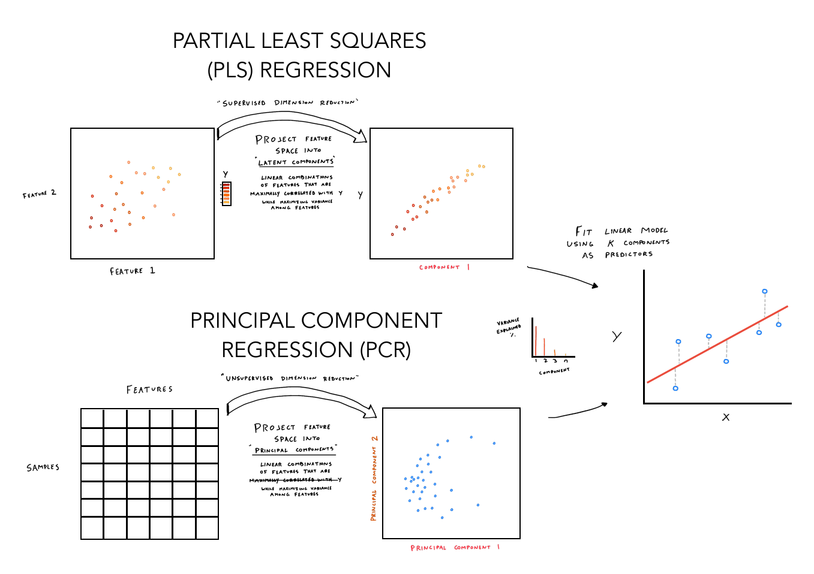

---
title: "Tabular Machine Learning Algorithms"
Author: Peter Dobranowski
date: "`r Sys.Date()`"

output: 
  bookdown::gitbook:
    split_by: section
  bookdown::pdf_book:
    keep_tex: no
documentclass: book
---


```{r setup, include=FALSE} 
knitr::opts_chunk$set(warning = FALSE, message = FALSE, echo = FALSE) 
```

```{r}
# To convert pdf to png, use this:
#plot.rreg = pdftools::pdf_convert("./ml_figures/Regularized_regression.pdf", format = "png", pages = 1, filenames = "./ml_figures/Regularized_regression.png")
#
```

```{r}
# A visual description of the "decision tree"

```

```{r}
# A visual description of the "random forest"
knitr::include_graphics("./ml_figures/Random_forest.png")
```

```{r}
# A visual description of the "gradient boosting machine"

```

```{r}
# A visual description of the "k nearest neighbours"
knitr::include_graphics("./ml_figures/K_nearest_neighbour.png")
```

```{r}
# A visual description of the "linear regression"
knitr::include_graphics("./ml_figures/Linear_regression.png")

```

```{r}
# A visual description of the "pls and pcr"

```

```{r}
# A visual description of the "regularized regression"
#
```

```{r}
# A visual description of the "neural network"
knitr::include_graphics("./ml_figures/Neural_network.png")
```

```{r}
# A visual description of the "support vector machine"

```

